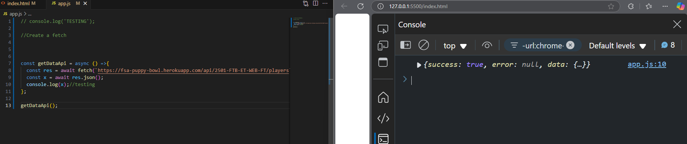
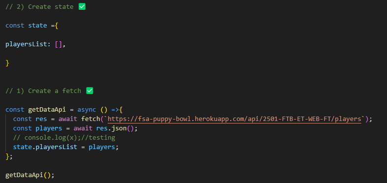
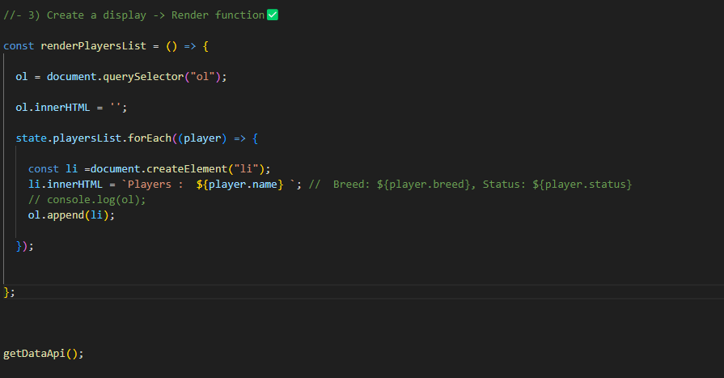
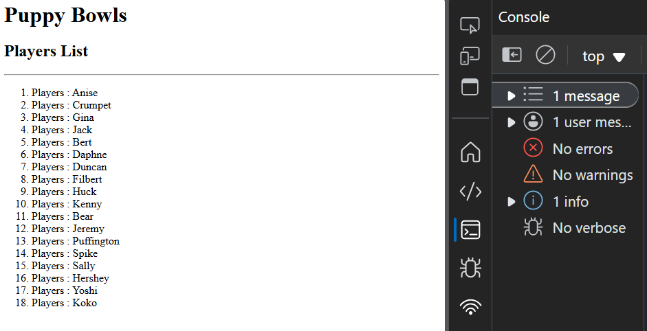
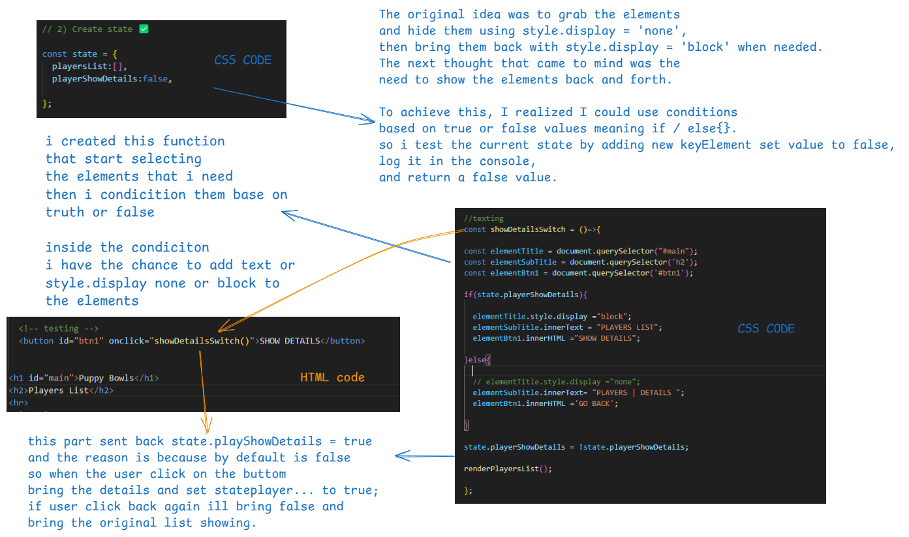
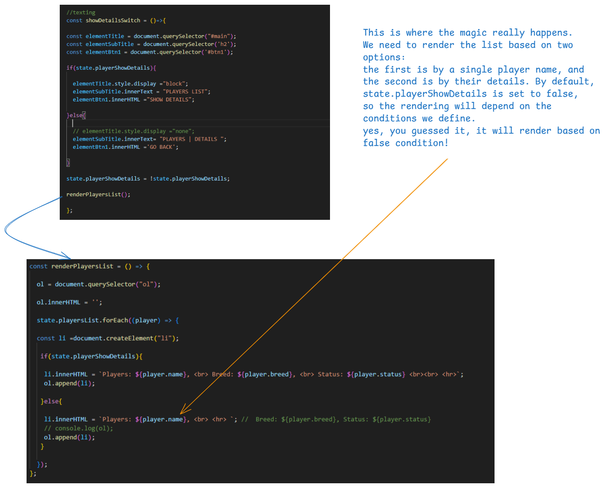
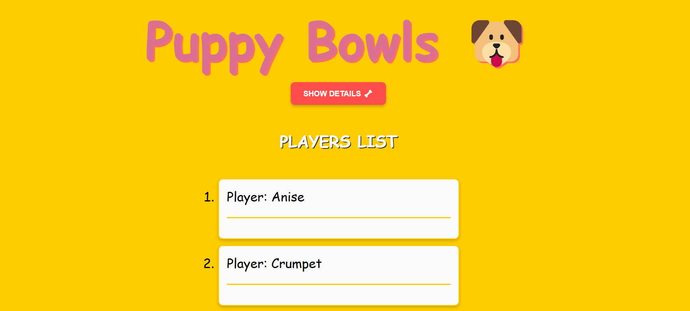
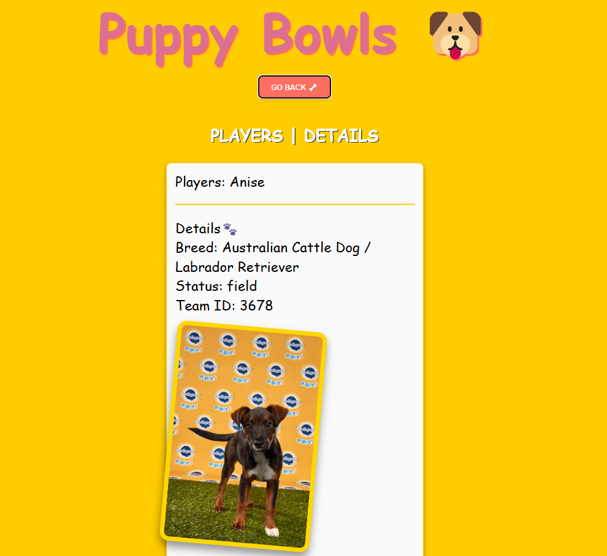
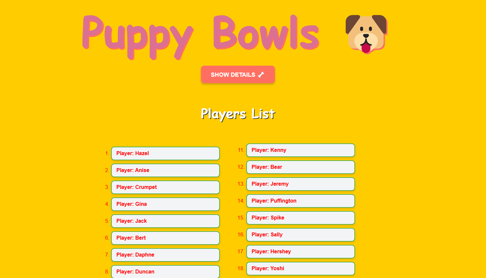
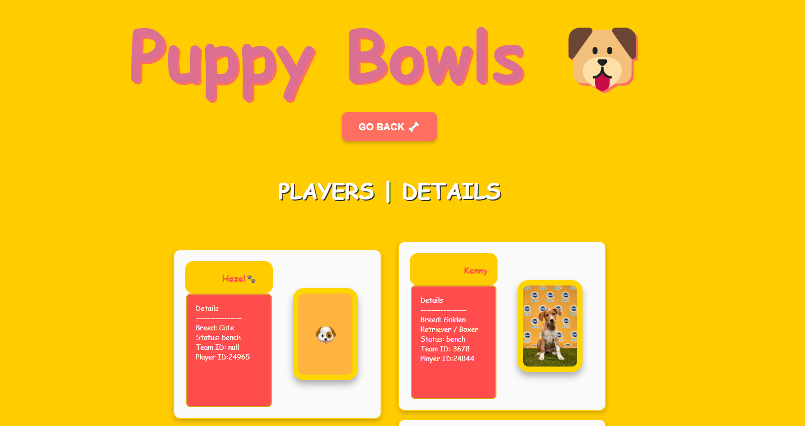

# 🐶Puppy Bowl 🦴
### Based on Calliope's email:


You are working with the humane society to add a mini-game to their website.
The game should allow visitors to see teams of puppies compete in a "puppy bowl".
Someone has already built out the API.
Overall, your job is to build out a functional client side. Request data from the API, then render that data on the front end. The front end should allow the user to: 

View the roster.
Observe a player's details.
Get back to the roster from the details page
All the data you need is available through the API. Your job is to leverage it.
### Pseudocode 

- 1) Create a fetch function✅
     done  

- 2) Create state ✅
 done 


---------------------------------------------------------------
- 3) Create a display -> Render function✅

    -  Display the roster✅

    - Display player details 
    >>i am planning to use 
    
    ```// Get the element you want to hide
    const element = document.getElementById("myElement"); 

    // Set the display property to "none"
    element.style.display = "none" /"block"; to show on and off data ```
    <hr>


    - Get back to the roster from the details page
   

----------------------------------------------------------------

- 4) add css




---------------------------------------------------

#  update CSS

 - animation 
 
 